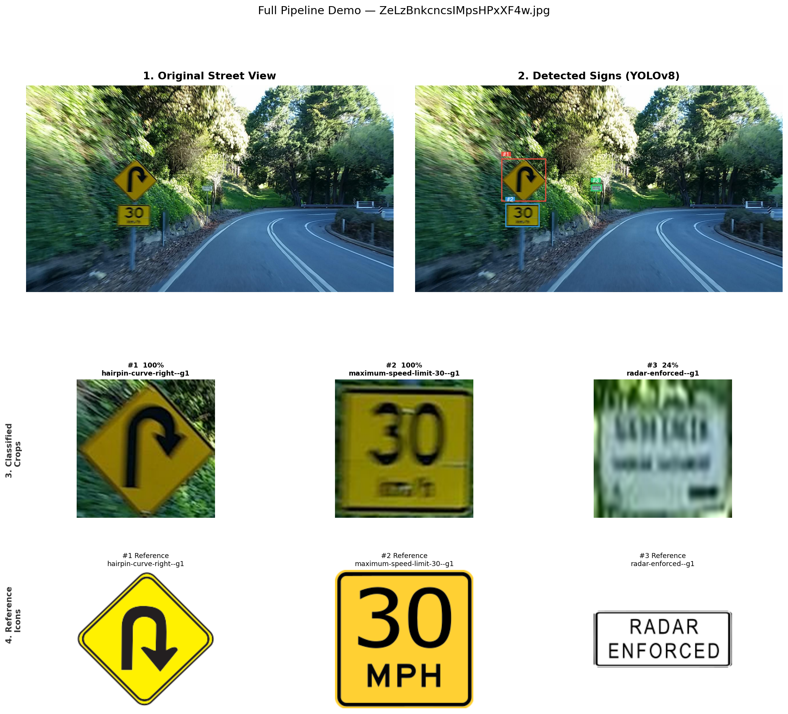
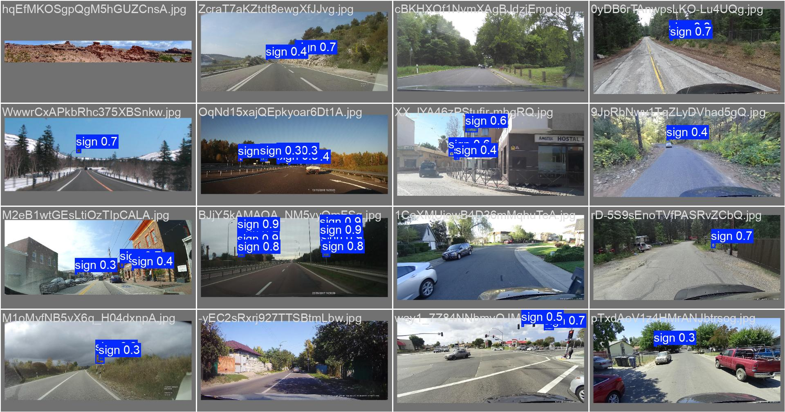
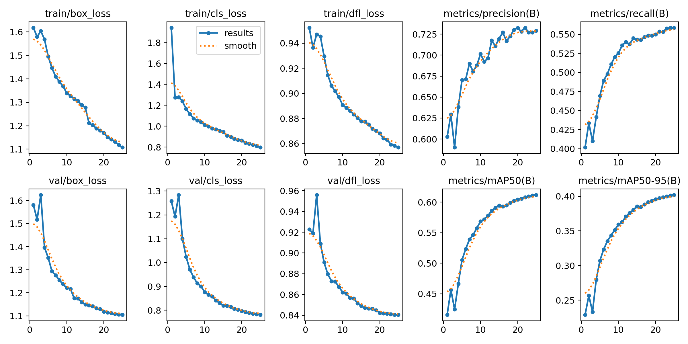

# GeoGuessr AI

> **WIP** — A computer vision pipeline that reads traffic signs from street-view images and uses them to infer geographic location.

---

## How it works

1. **Detect** — YOLOv8n finds traffic signs in the image
2. **Classify** — EfficientNet-B0 identifies each sign out of 400 MTSD classes
3. **Locate** — Sign labels are mapped to a country probability distribution

---

## Pipeline demos

Full pipeline on unseen validation images: original → detected → classified crop → reference icon.

---

## Sign detector

YOLOv8n trained on [MTSD](https://www.mapillary.com/dataset/trafficsign) — **61.2% mAP50** over 25 epochs on ~17k images.

---

## Status

| Component | Model | Performance |
|-----------|-------|-------------|
| Sign detector | YOLOv8n | 61.2% mAP50 |
| Sign classifier | EfficientNet-B0 | 96.5% val accuracy, 400 classes |
| Sign → geography | Country dist from MTSD GPS | Sparse — in progress |

See [JOURNAL.md](JOURNAL.md) for full work log.